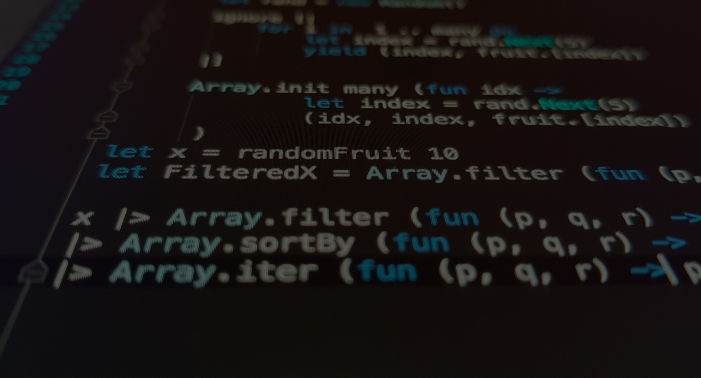

# 📦 Webpack Mastery Project

Проєкт з повною конфігурацією Webpack з TypeScript, ESLint та Bundle Analyzer для сучасної веб-розробки.

```
┌──────────────────────────────────────────────────────────────────┐
│  🚀 Webpack 5 + TypeScript + SASS + Babel + ESLint             │
│  ✅ Hot Reload | 🔤 Шрифти | 🖼️ Зображення | 🎨 CSS            │
│  📦 Code Splitting | 🌲 Tree Shaking | 📊 Bundle Analyzer      │
│  🔍 ESLint перевірка | ⚡ Оптимізація | 🎯 TypeScript підтримка │
└──────────────────────────────────────────────────────────────────┘
```

## 🚀 Швидкий старт

```bash
npm install && npm run dev
```

## 🚀 Функціональні можливості

### ✅ Повний набір інструментів:

1. **DevServer** з автоматичним перезавантаженням
   - Hot Module Replacement (HMR)
   - Порт 9000, автоматичне відкриття браузера
   - Watch режим для файлів у `src/`

2. **Робота з зовнішніми CSS файлами**
   - Підтримка чистого CSS
   - MiniCssExtractPlugin для production
   - style-loader для development

3. **Препроцесори: Sass/SCSS**
   - Підтримка `.sass` та `.scss` синтаксису
   - Source maps для debugging
   - Автоматична компіляція

4. **TypeScript компіляція**
   - Підтримка `.ts` та `.tsx` файлів
   - ts-loader для webpack
   - Перевірка типів через `npm run type-check`
   - Інтеграція з Babel

5. **Babel транспіляція**
   - ES6+ → ES5 для сумісності
   - Core-js polyfills
   - Підтримка останніх 2 версій браузерів + IE11

6. **ESLint перевірка коду**
   - Автоматична перевірка під час білду
   - Real-time перевірка в dev режимі
   - Автофікс через `npm run lint:fix`
   - Правила для JavaScript та TypeScript

7. **Webpack Bundle Analyzer**
   - Візуалізація розміру бандлів
   - Інтерактивний HTML звіт
   - Аналіз залежностей
   - Виявлення дублікатів коду

### 📦 Додаткові можливості:

- **Хешування файлів**: `[contenthash:8]` для cache busting
- **Локальні шрифти**: `.woff`, `.woff2`, `.eot`, `.ttf`, `.otf`
- **Зображення**: автоматична оптимізація та копіювання
- **Code Splitting**: розділення vendor коду
- **Tree Shaking**: видалення невикористаного коду

## 📦 Встановлення

```bash
npm install
```

## 🛠️ Доступні команди

### Основні команди:

```bash
# Development сервер з hot reload
npm run dev          # або npm start

# Production збірка
npm run build

# Development збірка (без мінімізації)
npm run build:dev

# Відслідковування змін
npm run watch

# Очищення dist папки
npm run clean
```

### TypeScript команди:

```bash
# Перевірка типів TypeScript
npm run type-check
```

### ESLint команди:

```bash
# Перевірка коду
npm run lint

# Автоматичне виправлення помилок
npm run lint:fix
```

### Bundle Analyzer:

```bash
# Production збірка з аналізом бандлів
npm run build:analyze
# Автоматично відкриє bundle-report.html
```

## 📁 Структура проєкту

```
.
├── dist/                           # Скомпільовані файли (генерується автоматично)
│   ├── css/                       # Скомпільовані CSS файли
│   ├── js/                        # Скомпільовані JavaScript файли
│   ├── img/                       # Скопійовані зображення
│   ├── bundle-report.html         # Bundle Analyzer звіт (якщо запущено)
│   └── index.html                 # Згенерований HTML
│
├── src/                            # Вихідні файли
│   ├── css/                       # CSS файли (normalize.css)
│   ├── img/                       # Зображення
│   ├── scss/                      # SASS стилі
│   │   ├── abstracts/             # Змінні, міксини
│   │   ├── base/                  # Базові стилі
│   │   ├── components/            # Компоненти
│   │   ├── layout/                # Макети
│   │   └── styles.sass            # Головний SASS файл
│   ├── index.html                 # HTML шаблон
│   ├── index.js                   # Головна точка входу (JS)
│   └── example.ts                 # Приклад TypeScript файлу
│
├── webpack.config.js               # Основна конфігурація Webpack
├── webpack.config.development.js   # Development конфігурація
├── webpack.config.production.js    # Production конфігурація
│
├── tsconfig.json                   # TypeScript конфігурація
├── eslint.config.mjs               # ESLint конфігурація
├── .babelrc                        # Babel конфігурація
│
└── package.json                    # NPM залежності
```

## 🎯 Використання

### Development режим

```bash
npm run dev
```

Запустить dev-сервер на `http://localhost:9000` з:
- Hot Module Replacement
- Source maps
- Автоматичне оновлення при зміні файлів

### Production збірка

```bash
npm run build
```

Створить оптимізовану збірку в папці `dist/` з:
- Мінімізацією JavaScript та CSS
- Хешуванням файлів
- Оптимізованими зображеннями
- Розділеним vendor кодом

## ⚙️ Конфігурація Webpack

### Основні можливості:

- **Entry Point**: `src/index.js`
- **Output**: `dist/` з хешованими іменами файлів
- **Dev Server**: порт 9000, hot reload
- **Source Maps**: різні для dev/prod

### Loaders:

- `ts-loader` - компіляція TypeScript
- `babel-loader` - транспіляція ES6+ до ES5
- `sass-loader` - компіляція SASS/SCSS
- `css-loader` - обробка CSS імпортів
- `style-loader` - інлайн CSS (dev)
- `MiniCssExtractPlugin.loader` - екстракт CSS (prod)
- `asset/resource` - шрифти та зображення

### Plugins:

- `HtmlWebpackPlugin` - генерація HTML з шаблону
- `MiniCssExtractPlugin` - витягування CSS у окремі файли
- `CleanWebpackPlugin` - очищення dist перед білдом
- `CopyWebpackPlugin` - копіювання статичних файлів
- `ESLintPlugin` - перевірка коду під час білду
- `BundleAnalyzerPlugin` - візуалізація бандлів

## 🔧 Babel конфігурація

Підтримка:
- Останніх 2 версій браузерів
- IE11+
- Core-js polyfills

## 📝 Приклади використання

### TypeScript приклади:

```typescript
// src/types/user.ts
export interface User {
  id: number;
  name: string;
  email: string;
}

export class UserManager {
  private users: User[] = [];

  addUser(user: User): void {
    this.users.push(user);
  }

  getUser(id: number): User | undefined {
    return this.users.find(u => u.id === id);
  }
}
```

```typescript
// src/index.ts
import type { User } from './types/user';
import { UserManager } from './types/user';

const manager = new UserManager();
const user: User = { id: 1, name: 'John', email: 'john@example.com' };
manager.addUser(user);
```

### JavaScript приклади:

```javascript
// src/index.js
// Імпорт стилів
import './css/normalize.css';
import './scss/styles.sass';

// Імпорт TypeScript модуля з JavaScript
import { UserManager } from './example.ts';

const manager = new UserManager();
```

### Імпорт зображень:

```javascript
// Використання webpack alias
import logo from '@img/logo.png';

// Або відносний шлях
import projectImg from './img/project.svg';

// Використання в коді
const img = document.createElement('img');
img.src = projectImg;
```

### Використання зображень в HTML:

```html
<!-- Зображення автоматично копіюються з src/img/ в dist/img/ -->


```

### SASS/SCSS приклади:

```scss
// src/scss/abstracts/_variables.scss
$primary-color: #3498db;
$font-stack: 'Helvetica Neue', Arial, sans-serif;

// src/scss/components/_button.scss
.button {
  background: $primary-color;
  font-family: $font-stack;

  &:hover {
    opacity: 0.8;
  }
}
```

### Використання шрифтів:

```scss
@font-face {
  font-family: 'CustomFont';
  src: url('../fonts/custom-font.woff2') format('woff2'),
       url('../fonts/custom-font.woff') format('woff');
  font-weight: normal;
  font-style: normal;
}

body {
  font-family: 'CustomFont', sans-serif;
}
```

## 📊 Оптимізація та аналіз

### Автоматична оптимізація:

- **Code Splitting**: автоматичне розділення vendor коду
- **Tree Shaking**: видалення невикористаного коду
- **Minification**: мінімізація JS та CSS у production
- **Cache Busting**: хешування файлів `[contenthash:8]`
- **Image Optimization**: файли < 8kb інлайнуються як base64

### Bundle Analyzer:

Запустіть аналіз бандлів:
```bash
npm run build:analyze
```

Що показує звіт:
- 📊 Розмір кожного модуля (parsed, gzipped)
- 🎯 Візуалізація дерева залежностей
- 🔍 Виявлення дублікатів коду
- 📦 Великі модулі для оптимізації
- 🌳 Структура бандлів у вигляді treemap

## 🐛 Debugging та перевірка коду

### Source Maps:
- **Development**: `eval-source-map` (швидка перебудова)
- **Production**: `source-map` (окремі .map файли)

### TypeScript перевірка:
```bash
npm run type-check
# Перевірка типів без компіляції
```

### ESLint перевірка:
```bash
# Перевірка коду
npm run lint

# Автоматичне виправлення
npm run lint:fix
```

### Dev режим:
- Автоматична перевірка ESLint під час збірки
- TypeScript помилки у консолі
- Hot reload при змінах
- Overlay з помилками у браузері

## 🎯 Технології та інструменти

### Основні:
- Webpack 5.106.1
- TypeScript 5.x
- Babel 7.29+
- Sass 1.99+
- ESLint 9.x

### Dev інструменти:
- webpack-dev-server (HMR)
- webpack-bundle-analyzer
- ts-loader для TypeScript
- eslint-webpack-plugin

### Плагіни:
- HtmlWebpackPlugin
- MiniCssExtractPlugin
- CleanWebpackPlugin
- CopyWebpackPlugin
- ESLintPlugin
- BundleAnalyzerPlugin

## 🚀 Швидкий старт для нових розробників

1. **Клонуйте репозиторій**
   ```bash
   git clone <repository-url>
   cd HillelFullStack-Figma-SimpleSite-Webpack
   ```

2. **Встановіть залежності**
   ```bash
   npm install
   ```

3. **Запустіть dev сервер**
   ```bash
   npm run dev
   ```

4. **Перевірте код**
   ```bash
   npm run lint
   npm run type-check
   ```

5. **Зробіть production білд з аналізом**
   ```bash
   npm run build:analyze
   ```

## 📄 Ліцензія

ISC

---

**Створено для навчальних цілей у рамках курсу Hillel IT School** 🎓
